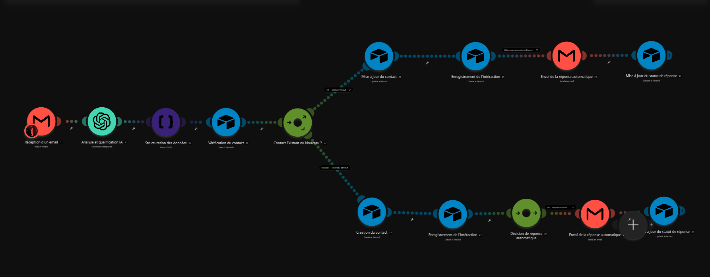
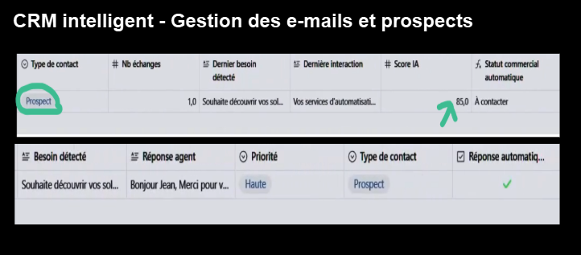
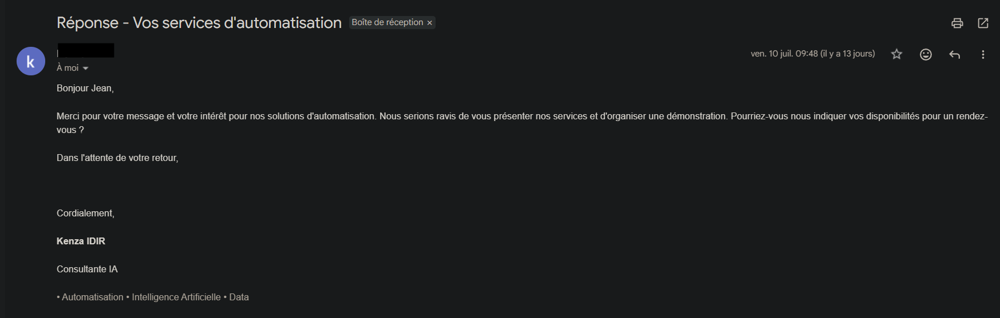
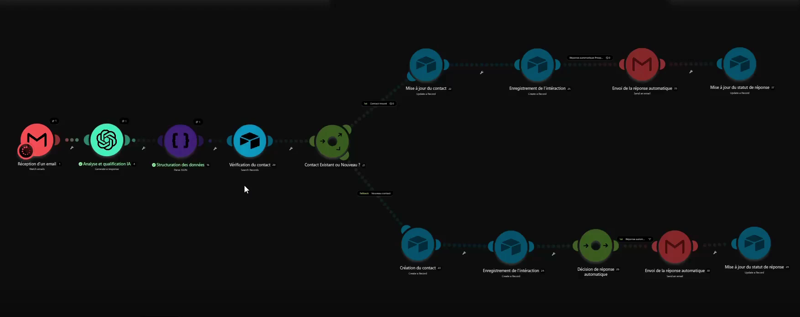
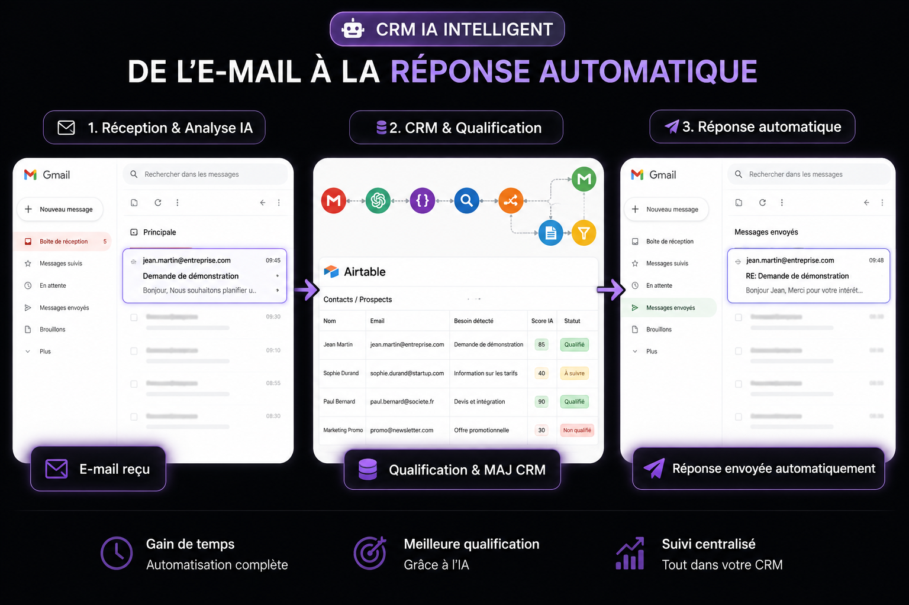

# 🤖 Système intelligent de qualification automatique des emails par IA

## Présentation

Ce projet présente une architecture d'automatisation intelligente permettant d'analyser automatiquement les emails entrants, de qualifier les prospects grâce à l'intelligence artificielle, de mettre à jour un CRM et d'envoyer des réponses automatiques uniquement lorsque cela est pertinent.

Cette architecture est entièrement **personnalisable** selon les besoins de chaque entreprise.

Quelques exemples d'utilisation :

- 📞 Service client
- 💼 Demandes de devis
- 🏠 Immobilier
- 🩺 Santé
- 🎓 Formation
- 👨‍💻 Support technique
- 🧑‍💼 Recrutement
- 🛍️ E-commerce
- 📈 Qualification commerciale

---

## Fonctionnement

1. Réception d'un email
2. Analyse intelligente du contenu avec OpenAI
3. Qualification automatique du besoin
4. Calcul d'un score IA
5. Vérification du contact dans le CRM
6. Création ou mise à jour du contact
7. Enregistrement de l'interaction
8. Envoi d'une réponse automatique uniquement si le prospect est qualifié

---

## Technologies utilisées

- Make
- OpenAI (GPT)
- Gmail
- Airtable
- JSON

---

## Fonctionnalités

•  Analyse automatique des emails

•  Qualification intelligente des prospects

•  Calcul d'un score IA

•  Détection automatique du besoin

•  Création ou mise à jour du CRM

•  Historique complet des interactions

•  Réponse automatique conditionnelle

•  Architecture réutilisable et personnalisable

---

## Aperçu du projet

### Architecture générale

---

### Gestion des contacts dans Airtable

---

### Réponse automatique générée par l'IA

---

### Exécution du workflow Make

---

## Démonstration

Cette vidéo présente le fonctionnement de la solution CRM intelligente : réception d'un e-mail, analyse par IA, qualification du prospect, mise à jour du CRM Airtable et envoi automatique d'une réponse.

**▶️ Cliquez pour ouvrir la vidéo de démonstration.**

---

## Cas d'utilisation

Cette architecture peut être adaptée à de nombreux secteurs :

- PME
- TPE
- Indépendants
- Cabinets de conseil
- Agences
- Cabinets médicaux
- Organismes de formation
- Immobilier
- Services administratifs
- Support client

---

## Réalisé par

**Kenza IDIR**

Consultante IA & Automatisation
